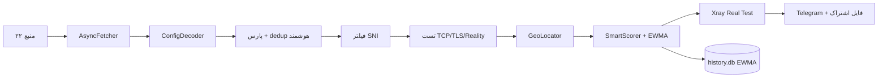

# V2Ray Smart Collector v4

<div align="center">

**جمع‌آوری خودکار، تست چندمرحله‌ای و انتشار کانفیگ‌های V2Ray** — نسخه ۴ ماژولار

[](https://github.com/alireza786786/alireza786786/actions/workflows/run.yml)


</div>

## ✨ ویژگی‌ها

- **۶ پروتکل** — vless / trojan / hysteria2 / shadowsocks / vmess (فعال) · ۲۲ منبع
- **پورت‌های طلایی دو ردیفه** — T1: 443, 2053, 2083, 2087, 2096, 8443 · T2: 80, 2052, 2082, 2086, 8080, 8880 — با بونس امتیازی و سوییچ فیلتر
- **dedup هوشمند** — در host:port تکراری، با‌ارزش‌ترین پروتکل می‌ماند
- **فیلتر SNI** — عامل واقعی عبور از فیلترینگ: اعتبار دامنه + رزولوشن DNS
- **امتیازدهی نسل جدید** — **EWMA** (اعتبار نمایی وزنی) + پینگ + پایداری + کشور
- **پیکربندی با `config.yaml` + CLI** — تنظیم بدون دست‌زدن به کد
- **تست واقعی Xray** + انتشار خودکار تلگرام/ریپو

## 🚀 شروع سریع

```bash
pip install -r requirements.txt            # نصب وابستگی‌ها
cp config.example.yaml config.yaml         # (اختیاری) شروع با پیکربندی نمونه
python -m v2ray_collector run --dry-run --top 10   # آزمایش بدون ارسال
BOT_TOKEN=... CHAT_ID=@Goodbaye_filtering python -m v2ray_collector run
```

| دستور | کار |
|---|---|
| `--config مسیر` | پیکربندی دلخواه (پیش‌فرض: `config.yaml`) |
| `--dry-run` | فقط ساخت فایل‌ها — بدون ارسال تلگرام |
| `--top N` | نمایش N نود برتر در پایان |
| `-v` | لاگ دقیق‌تر |

## ⚙️ فرایند



## 🧱 ساختار

```
v2ray_collector/          پکیج ماژولار
├── cli.py                رابط خط فرمان
├── config.py             پیکربندی (YAML + env)
├── parser.py             پارس همه پروتکل‌ها
├── database.py           SQLite + EWMA (thread-safe)
├── net.py                فچر + تست‌ها + فیلتر SNI
├── geo.py                جغرافیا
├── scorer.py             امتیازدهی نسل جدید
├── xray_test.py          تست واقعی Xray
├── telegram.py           انتشار تلگرام
└── pipeline.py           خط لوله اصلی
tests/                    ۲۷ تست pytest
config.example.yaml       نمونه پیکربندی
v2ray_collector_v3.py     لانچر سازگار نسخه قبلی
```

## 🕐 اجرای خودکار

workflow `run.yml` هر ۶ ساعت اسکریپت را می‌راند (`python -m v2ray_collector run`)؛ خروجی خودکار در ریپو کامیت می‌شود. تلگرام با سکرت‌های `BOT_TOKEN` / `CHAT_ID` در Settings → Secrets فعال می‌شود.

## 📌 یادداشت‌ها

- پورت طلایی و SNI «سیگنال کیفیت» هستند، نه تضمین عبور — عامل اصلی، کیفیت پروتکل و دامنه SNI است
- hysteria2 فقط با TCP-ping فیلتر می‌شود (معمول واقعی نیاز به پروب QUIC دارد)
- برای تست‌ها: `python -m pytest tests -v`